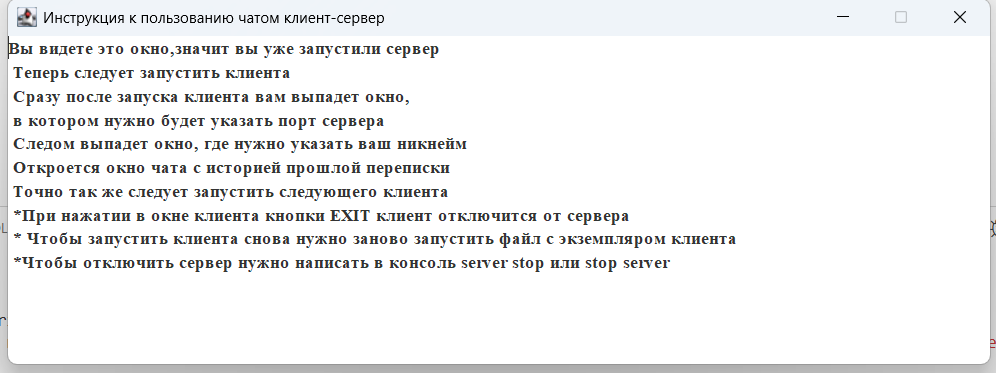

# Домашняя работа 
_Задание:  Разработайте простой чат на основе сокетов. Ваше приложение должно включать в себя сервер, который принимает сообщения от клиентов и пересылает их всем участникам чата_
## _Решение:_

Вот такие окна для получения информации о пользователе: 

Диолаговое окно упользователей одинаковое:

* так же есть опция сохранения переписки
