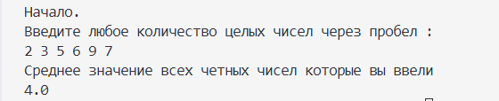

# _Домашняя работа №1_
_Задание:_

1. Напишите программу, которая использует Stream API для обработки списка чисел. Программа должна вывести на экран среднее значение всех четных чисел в списке.
## _Решение:_
* решение реализованно в классе [Kit](). Метод:

```
Scanner sc = new Scanner(System.in);          
        System.out.print("Начало.\nВведите любое количество целых чисел через пробел :\n");
        String input = sc.nextLine();
        Stream<Integer> list = Stream.of(input.split(" ")) 
                                    .map(String::trim) // убираю лишние пробелв
                                    .filter(s -> !s.isEmpty()) // отфильтровываю пустые строки
                                    .map(Integer::parseInt); // преобразование строки в число
        double middle = list.filter(n -> n % 2 == 0) // оставляем только четные число
                            .mapToDouble(Double::valueOf).average() // среднее значение
                            .orElse(0); // если таких чисел нет возвращаем 0

        System.out.println("Среднее значение всех четных чисел которые вы ввели:\n"+ String.valueOf(middle));
```
* Выполненный код:


